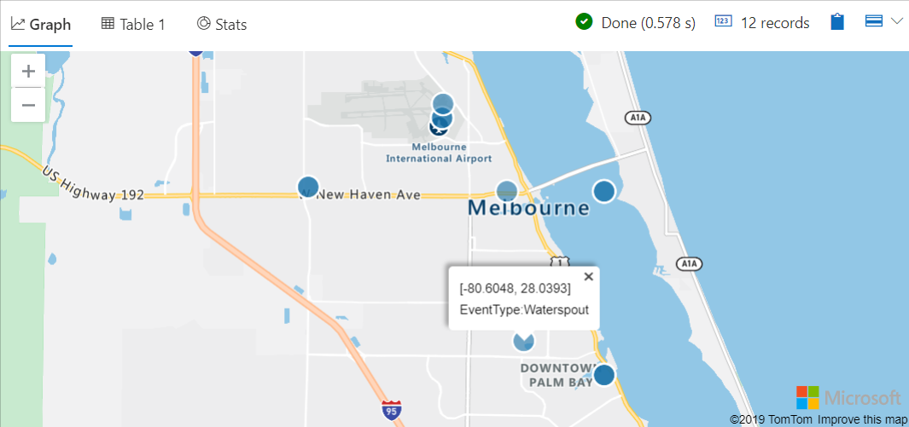
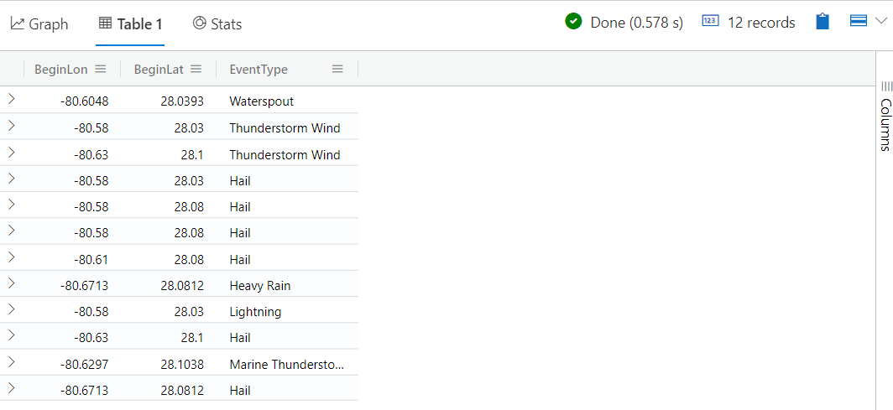
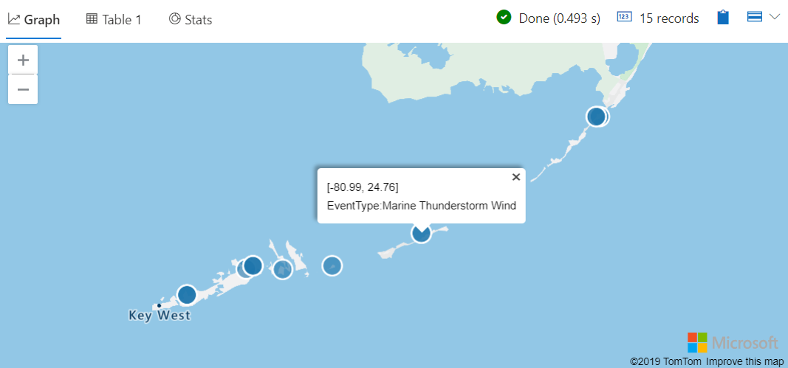
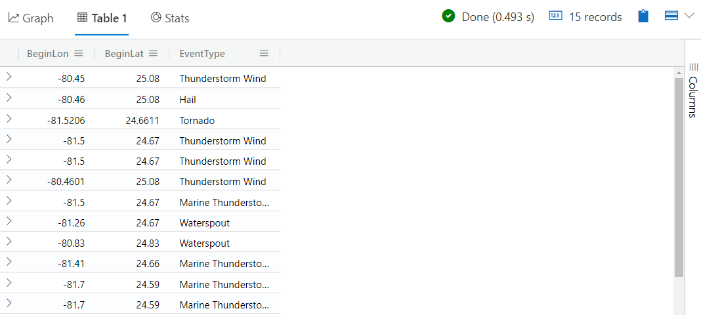

# Module 4 - Geoclustering

## Demo 1 - Nearby Events

### 1.1 Geo Point in Circle - Overview

In this demo, we will look at two functions that calculate proximity for geographic data. The first of these is geo_point_in_circle. As its name implies, it will return data whose coordinates fall within a specified radius of a center point.

#### 1.1.1 Examining the Code

We'll begin this demo with a simple example. We'll start by declaring a datatable and placing it into a variable, T. It will hold three columns, a longitude, latitude, and a place name.

```python
let T = datatable(longitude:real, latitude:real, place:string)
[
    real(-122.317404), 47.609119, 'Seattle',                   // In circle
    real(-123.497688), 47.458098, 'Olympic National Forest',   // In exterior of circle  
    real(-122.201741), 47.677084, 'Kirkland',                  // In circle
    real(-122.443663), 47.247092, 'Tacoma',                    // In exterior of circle
    real(-122.121975), 47.671345, 'Redmond',                   // In circle
];
```

Next, we will declare three variables. The first is the radius, in meters, for our circle. Next we declare the longitude and latitude for the center point of our circle.

```python
let radius = 18000;
let centerLong = -122.317404;
let centerLat = 47.609119;
```

Finally, we will take our data table, stored in the variable T, and pass it into the `geo_point_in_circle` function.

```python
T | where geo_point_in_circle(longitude, latitude, centerLong, centerLat, radius)
  | project place
```

In the first two parameters, we pass in the names of the columns from the source data table, in this case T, that correspond to the longitude and latitude. In the next two positions we pass in the long/lat for the center point of our circle. Finally, we pass in the radius for our circle.

This acts as a filter, only rows of data that are inside the radius of our circle will get passed through. As a final step we reduce our output to just contain the names of the places within our circle.

#### 1.1.2 Analyzing the Output

Running the query returns a simple output.

| place |
| ----- |
| Seattle |
| Kirkland |
| Redmond |

In this example, the `geo_point_in_circle` function was used to filter our data down to just the rows that fall inside our circle.

Let's look at something a little more advanced for this next example.

#### 1.2.1 Examining the Code

For this example we will draw data from the StormEvents table, part of the Azure Data Explorer examples.

This table includes events, such as thunder storms, hail, wind and other weather related events, along with the longitude and latitude where they occurred. We'll analyze events from this table, this time plotting the results to a map.

```python
let radius = 10000;
let centerLong = -80.6048;
let centerLat = 28.0393;
StormEvents
  | where isnotempty( BeginLat) and isnotempty( BeginLon)
  | project BeginLon, BeginLat, EventType
  | where geo_point_in_circle(BeginLon, BeginLat, centerLong, centerLat, radius)
  | render scatterchart with (kind = map)
```

As in the previous example, we have variables setup to hold our radius, in this case 10,000 meters, along with the longitude and latitude for the center of our circle.

The storm events table stores the location an event was first spotted in the BeginLat and BeginLon column names. It's important we have that data for the `geo_point_in_circle` function to work. Since that data may not always be present, we pipe our storm events table through a `where` clause to remove any rows where either of these pieces of data are missing.

A key to dealing efficiently with data inside Azure Data Explorer is to trim down that data as much as possible. As such, in the `project` line we'll strip the data to just the three columns we'll need.

Now we pass the data into the `geo_point_in_circle` function, using it to filter out events not inside our circle.

As a last step, we then render the output as a scatterchart, adding the `kind = map` to indicate we want the scatter chart to be overlaid upon a map.

#### 1.2.2 Analyzing the Output

Looking at the output, we see a nice map, with dots where specific events occurred within our circle.



Note that the center point for the circle was also an event, a waterspout. Clicking on it revealed the exact coordinates, along with the name of the event.

If you wish to see the output in text, simply click on the Table tab above the map.



### 1.3 Geo Distance Point to Line - Overview

In our last example, we used geo_point_in_circle to filter our data to only those points that existed within a circle. What if we didn't have a nice neat circle though?

What if we needed to find storm events that were located in close proximity to, let's say, a major highway? Well that's where the geo_distance_point_to_line comes in.

#### 1.3.1 Examining the Code

```python
let distanceFromLine = 500;  // 500 meters
let geoLine = dynamic( { "type":"LineString"
                       , "coordinates":[ [-81.76849365234375,24.56211235799689]
                                       , [-81.507568359375,24.669482313373848]
                                       , [-81.34002685546875,24.649513490158643]
                                       , [-81.04339599609375,24.731864277701714]
                                       , [-80.771484375,24.856534339310674]
                                       , [-80.53253173828124,24.991036982463747]
                                       , [-80.39794921875,25.147770882723563]
                                       ]
                       }
                     );
```

The first variable is pretty obvious, it is our distance from the line, in meters, we want our data to lie in. In this case we will use 500 meters as our value.

The second variable, geoLine, holds json data that includes an array of longitudes / latitudes for the line. I've already run the query so, thanks to the magic of my video editing software, I can overlay a line on the screen which corresponds roughly to the array of coordinates in our geoLine variable. As you can see, it roughly covers the route of US Highway 1 from Key West up to Key Largo.

Next we take the storm events, filter out the rows with either an empty long or lat, then reduce to just the three columns we need using project.

```python
StormEvents
  | where isnotempty( BeginLat ) and isnotempty( BeginLon )
  | project BeginLon, BeginLat, EventType
  | where geo_distance_point_to_line( BeginLon, BeginLat, geoLine ) < distanceFromLine
  | render scatterchart with (kind = map)
```

Now we get to the heart of this demo, and use the `geo_distance_point_to_line` function to filter the results down to just those storm events whose distance from the line is less than 500 meters.

Finally we render the results as a scatter chart overlaid onto a map.

#### 1.3.2 Analyzing the Output

Here are the results, laid on a nice map.



Note the circles of storm events along the geographic line through the Florida keys. You'll see we've clicked on one of the events to display its coordinates along with the type of event.

If you wish to see the text output, then simply click on the Table tab as we did in the previous example with geographic circles.



### Summary

In this demo, we examined functions for returning results that are within a specified geographic distance from either a single point, or along a geographic line.
