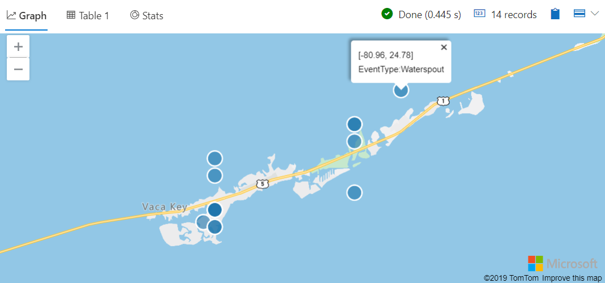
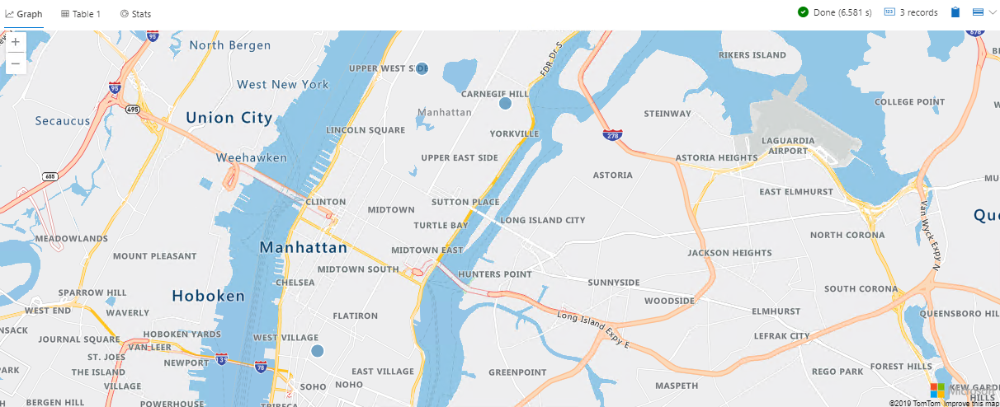

# Module 4 - Geoclustering

## Demo 2 - Geofencing

### 2.1 - Polygon Overview

The focus of this demo is the function `geo_point_in_polygon`. You can think of a polygon like a fence that wraps around a geographic area.

#### 2.1.1 Examining the Code

In this first example, we will define a single polygon, that is a single area we want to plot data for. We'll start the query by defining a json variable that holds the coordinates of our polygon.

```python
let polygon = dynamic( { "type":"Polygon"
                       , "coordinates":[ [ [-81.06880187988281,24.75306702526595]
                                         , [-81.12510681152344,24.728122241065808]
                                         , [-81.13609313964844,24.691319554166277]
                                         , [-81.09901428222656,24.671978191593258]
                                         , [-81.03858947753905,24.70005337937338]
                                         , [-80.97129821777344,24.718766657061526]
                                         , [-80.92391967773438,24.74558411549905]
                                         , [-80.86624145507812,24.775513050757333]
                                         , [-80.93215942382812,24.79483832122786]
                                         , [-81.06880187988281,24.75306702526595]
                                         ]
                                       ]
                       }
                     );
```

Next, we'll follow a similar pattern that we did in the previous demo.

```python
StormEvents
  | where isnotempty( BeginLat ) and isnotempty( BeginLon )
  | project BeginLon, BeginLat, EventType
  | where geo_point_in_polygon(BeginLon, BeginLat, polygon)
  | render scatterchart with (kind = map)
```

We take our storm events data and filter it through the `where` clause to remove rows that are missing the important lat and long values. Next, we use `project` to reduce the data to just the columns we need.

The next line is where we call the focus for this demo, the `geo_point_in_polygon` function. We pass in the names of the columns from the incoming data that represent the longitude and latitudes. Finally we pass in the polygon to use as our "fence".

In the last step we simply overlay our scatter chart upon a map.

#### 2.1.2 Analyzing the Output

As you can see, Azure Data Explorer renders a nice map with the storm events laid out on it.



Here you can see each event, one of them we've clicked on so it will display the coordinates and the event type.

Clicking the Table tap will produce a text listing of longitudes, latitudes, and event types. As this is similar to what you've seen before, we won't reproduce it here.

### 2.2 - Multi Polygon Overview

In addition to a single polygon, it's also possible to use `geo_point_in_polygon` with multiple polygons. This is useful when, for example, you want to omit a section from a map for analysis purposes.

#### 2.2.1 Examining the Code

We begin with an extremely long json variable declaration. If you look closely, it actually contains three separate arrays of coordinates within it.

```python
let multipolygon = dynamic( { "type":"MultiPolygon"
                            , "coordinates":[ [ [ [-73.991460000000131,40.731738000000206]
                                                , [-73.992854491775518,40.730082566051351]
                                                , [-73.996772,40.725432000000154]
                                                , [-73.997634685522883,40.725786309886963]
                                                , [-74.002855946639244,40.728346630056791]
                                                , [-74.001413,40.731065000000207]
                                                , [-73.996796995070824,40.73736378205173]
                                                , [-73.991724524037934,40.735245208931886]
                                                , [-73.990703782359589,40.734781896080477]
                                                , [-73.991460000000131,40.731738000000206]
                                                ]
                                              ]
                                              ,
                                              [
                                                [ [-73.958357552055688,40.800369095633819]
                                                , [-73.98143901556422,40.768762584141953]
                                                , [-73.981548752788598,40.7685590292784]
                                                , [-73.981565335901905,40.768307084720796]
                                                , [-73.981754418060945,40.768399727738668]
                                                , [-73.982038573548124,40.768387823012056]
                                                , [-73.982268248204349,40.768298621883247]
                                                , [-73.982384797518051,40.768097213086911]
                                                , [-73.982320919746599,40.767894461792181]
                                                , [-73.982155532845766,40.767756204474757]
                                                , [-73.98238873834039,40.767411004834273]
                                                , [-73.993650353659021,40.772145571634361]
                                                , [-73.99415893763998,40.772493009137818]
                                                , [-73.993831082030937,40.772931787850908]
                                                , [-73.993891252437052,40.772955194876722]
                                                , [-73.993962585514595,40.772944653908901]
                                                , [-73.99401262480508,40.772882846631894]
                                                , [-73.994122058082397,40.77292405902601]
                                                , [-73.994136652588594,40.772901870174394]
                                                , [-73.994301342391154,40.772970028663913]
                                                , [-73.994281535134448,40.77299380206933]
                                                , [-73.994376552751078,40.77303955110149]
                                                , [-73.994294029824005,40.773156243992048]
                                                , [-73.995023275860802,40.773481196576356]
                                                , [-73.99508939189289, 40.773388475039134]
                                                , [-73.995013963716758,40.773358035426909]
                                                , [-73.995050284699261,40.773297153189958]
                                                , [-73.996240651898916,40.773789791397689]
                                                , [-73.996195837470992,40.773852356184044]
                                                , [-73.996098807369748,40.773951805299085]
                                                , [-73.996179459973888,40.773986954351571]
                                                , [-73.996095245226442,40.774086186437756]
                                                , [-73.995572265161172,40.773870731394297]
                                                , [-73.994017424135961,40.77321375261053]
                                                , [-73.993935876811335,40.773179512586211]
                                                , [-73.993861942928888,40.773269531698837]
                                                , [-73.993822393527211,40.773381758622882]
                                                , [-73.993767019318497,40.773483981224835]
                                                , [-73.993698463744295,40.773562141052594]
                                                , [-73.993358326468751,40.773926888327956]
                                                , [-73.992622663865575,40.774974056037109]
                                                , [-73.992577842766124,40.774956016359418]
                                                , [-73.992527743951555,40.775002110439829]
                                                , [-73.992469745815342,40.775024159551755]
                                                , [-73.992403837191887,40.775018140390664]
                                                , [-73.99226708903538, 40.775116033858794]
                                                , [-73.99217809026365, 40.775279293897171]
                                                , [-73.992059084937338, 40.775497598192516]
                                                , [-73.992125372394938, 40.775509075053385]
                                                , [-73.992226867797001, 40.775482211026116]
                                                , [-73.992329346608813, 40.775468900958522]
                                                , [-73.992361756801131, 40.775501899766638]
                                                , [-73.992386042960277, 40.775557180424634]
                                                , [-73.992087684712729, 40.775983970821372]
                                                , [-73.990927174149746, 40.777566878763238]
                                                , [-73.99039616003671,40.777585065679204]
                                                , [-73.989461267506471, 40.778875124584417]
                                                , [-73.989175778438053, 40.779287524015778]
                                                , [-73.988868617400072, 40.779692922911607]
                                                , [-73.988871874499793, 40.779713738253008]
                                                , [-73.989219022880576, 40.779697895209402]
                                                , [-73.98927785904425, 40.779723439271038]
                                                , [-73.989409054180143, 40.779737706471963]
                                                , [-73.989498614927044, 40.779725044389757]
                                                , [-73.989596493388234, 40.779698146683387]
                                                , [-73.989679812902509, 40.779677568658038]
                                                , [-73.989752702937935, 40.779671244211556]
                                                , [-73.989842247806507, 40.779680752670664]
                                                , [-73.990040102120489, 40.779707677698219]
                                                , [-73.990137977524839, 40.779699769704784]
                                                , [-73.99033584033225, 40.779661794394983]
                                                , [-73.990430598697046, 40.779664973055503]
                                                , [-73.990622199396725, 40.779676064914298]
                                                , [-73.990745069505479, 40.779671328184051]
                                                , [-73.990872114282197, 40.779646007643876]
                                                , [-73.990961672224358, 40.779639683751753]
                                                , [-73.991057472829539, 40.779652352625774]
                                                , [-73.991157429497036, 40.779669775606465]
                                                , [-73.991242817404469, 40.779671367084504]
                                                , [-73.991255318289745, 40.779650782516491]
                                                , [-73.991294887120119, 40.779630209208889]
                                                , [-73.991321967649895, 40.779631796041372]
                                                , [-73.991359455569423, 40.779585883337383]
                                                , [-73.991551059227476, 40.779574821437407]
                                                , [-73.99141982585985, 40.779755280287233]
                                                , [-73.988886144117032, 40.779878898532999]
                                                , [-73.988939656706265, 40.779956178440393]
                                                , [-73.988926103530844, 40.780059292013632]
                                                , [-73.988911680264692, 40.780096037146606]
                                                , [-73.988919261468567, 40.780226094343945]
                                                , [-73.988381050202634, 40.780981074045783]
                                                , [-73.988232413846987, 40.781233144215555]
                                                , [-73.988210420831663, 40.781225482542055]
                                                , [-73.988140000000143, 40.781409000000224]
                                                , [-73.988041288067166, 40.781585961353777]
                                                , [-73.98810029382463, 40.781602878305286]
                                                , [-73.988076449145055, 40.781650935001608]
                                                , [-73.988018059972219, 40.781634188810422]
                                                , [-73.987960792842145, 40.781770987031535]
                                                , [-73.985465811970457, 40.785360700575431]
                                                , [-73.986172704965611, 40.786068452258647]
                                                , [-73.986455862401996, 40.785919219081421]
                                                , [-73.987072345615601, 40.785189638820121]
                                                , [-73.98711901394276, 40.785210319004058]
                                                , [-73.986497781023601, 40.785951202887254]
                                                , [-73.986164628806279, 40.786121882448327]
                                                , [-73.986128422486075, 40.786239001331111]
                                                , [-73.986071135219746, 40.786240706026611]
                                                , [-73.986027274789123, 40.786228964236727]
                                                , [-73.986097637849426, 40.78605822569795]
                                                , [-73.985429321269592, 40.785413942184597]
                                                , [-73.985081137732209, 40.785921935110366]
                                                , [-73.985198833254501, 40.785966552197777]
                                                , [-73.985170502389906, 40.78601333415817]
                                                , [-73.985216218673656, 40.786030501816427]
                                                , [-73.98525509797993, 40.785976205511588]
                                                , [-73.98524273937646, 40.785972572653328]
                                                , [-73.98524962933017, 40.785963139855845]
                                                , [-73.985281779186749, 40.785978620950075]
                                                , [-73.985240032884533, 40.786035858136792]
                                                , [-73.985683885242182, 40.786222123919686]
                                                , [-73.985717529004575, 40.786175994668795]
                                                , [-73.985765660297687, 40.786196274858618]
                                                , [-73.985682871922691, 40.786309786213067]
                                                , [-73.985636270930442, 40.786290150649279]
                                                , [-73.985670722564691, 40.786242911993817]
                                                , [-73.98520511880038, 40.786047669212785]
                                                , [-73.985211035607492, 40.786039554883686]
                                                , [-73.985162639946992, 40.786020999769754]
                                                , [-73.985131636312062, 40.786060297019972]
                                                , [-73.985016964065125, 40.78601423719563]
                                                , [-73.984655078830457, 40.786534741807841]
                                                , [-73.985743787901043, 40.786570082854738]
                                                , [-73.98589227228328, 40.786426529019593]
                                                , [-73.985942854994988, 40.786452847880334]
                                                , [-73.985949561556794, 40.78648711396653]
                                                , [-73.985812373526713, 40.786616865357047]
                                                , [-73.985135209703174, 40.78658761889551]
                                                , [-73.984619428584324, 40.786586016349787]
                                                , [-73.981952458164173, 40.790393724337193]
                                                , [-73.972823037363767, 40.803428052816756]
                                                , [-73.971036786332192, 40.805918478839672]
                                                , [-73.966701, 40.804169000000186]
                                                , [-73.959647, 40.801156000000113]
                                                , [-73.958508540159471, 40.800682279767472]
                                                , [-73.95853274080838, 40.800491362464697]
                                                , [-73.958357552055688, 40.800369095633819]
                                                ]
                                              ]
                                              ,
                                              [ [ [-73.943592454622546, 40.782747908206574]
                                                , [-73.943648235390199, 40.782656161333449]
                                                , [-73.943870759887162, 40.781273026571704]
                                                , [-73.94345932494096, 40.780048275653243]
                                                , [-73.943213862652243, 40.779317588660199]
                                                , [-73.943004239504688, 40.779639495474292]
                                                , [-73.942716005450905, 40.779544169476175]
                                                , [-73.942712374762181, 40.779214856940001]
                                                , [-73.942535563208608, 40.779090956062532]
                                                , [-73.942893408188027, 40.778614093246276]
                                                , [-73.942438481745029, 40.777315235766039]
                                                , [-73.942244919522594, 40.777104088947254]
                                                , [-73.942074188038887, 40.776917846977142]
                                                , [-73.942002667222781, 40.776185317382648]
                                                , [-73.942620205199006, 40.775180871576474]
                                                , [-73.94285645694552, 40.774796600349191]
                                                , [-73.94293043781397, 40.774676268036011]
                                                , [-73.945870899588215, 40.771692257932997]
                                                , [-73.946618690150586, 40.77093339256956]
                                                , [-73.948664164778933, 40.768857624399587]
                                                , [-73.950069793030679, 40.767025088383498]
                                                , [-73.954418260786071, 40.762184104951245]
                                                , [-73.95650786241211, 40.760285256574043]
                                                , [-73.958787773424007, 40.758213471309809]
                                                , [-73.973015157270069, 40.764278692864671]
                                                , [-73.955760332998182, 40.787906554459667]
                                                , [-73.944023, 40.782960000000301]
                                                , [-73.943592454622546, 40.782747908206574]
                                                ]
                                              ]
                                            ]
                            }
                          );
```

For this demo, we're going to move north to the city that never sleeps, New York, and specifically Manhattan. We are going to include three different polygons. One will be just to the west of the historic Central Park, one just to the east, and one south around the East Village area.

Our goal is to plot storm events, but we want to omit the Central Park area. This will let us focus on areas with sky scrapers and omit a natural area like the park.

The next section is almost identical to the previous one, except for the name of our polygon variable, `multipolygon`.

```python
StormEvents
| where isnotempty( BeginLat ) and isnotempty( BeginLon )
| project BeginLon, BeginLat, EventType
| where geo_point_in_polygon(BeginLon, BeginLat, multipolygon)
| render scatterchart with (kind = map)
```

As a quick recap, we filter out data with missing lats or longs, reduce it to just the data we need, run it through the `geo_point_in_polygon` function, then render as a scatterchart over a map.

#### 2.2.2 Analyzing the Output

Here is the results of our query.



Looking closely, you'll see one storm plotted in the upper middle, beside the Upper West Side. This was the area defined in one of our polygons, just to the west of Central Park.

There's a second storm event just under Carnegie Hill, in the area defined by the polygon placed just to the east of Central Park.

Finally, theres another event that was located in our third polygon, partway between the West Village and Soho.

### Summary

When you need to search for events inside a defined area, or more than one area, the `geo_point_in_polygon` function will quickly become your favorite tool.
