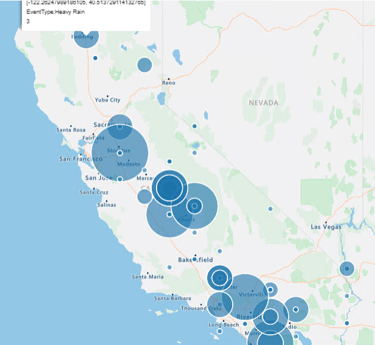
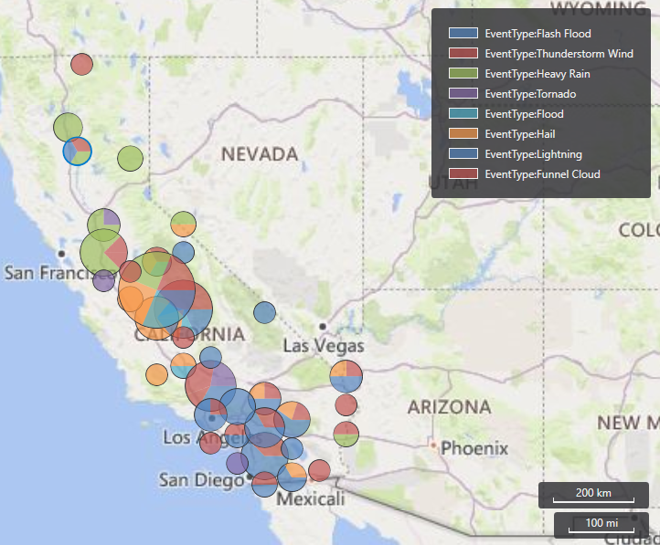
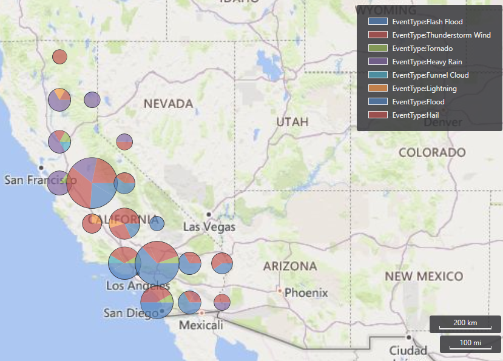
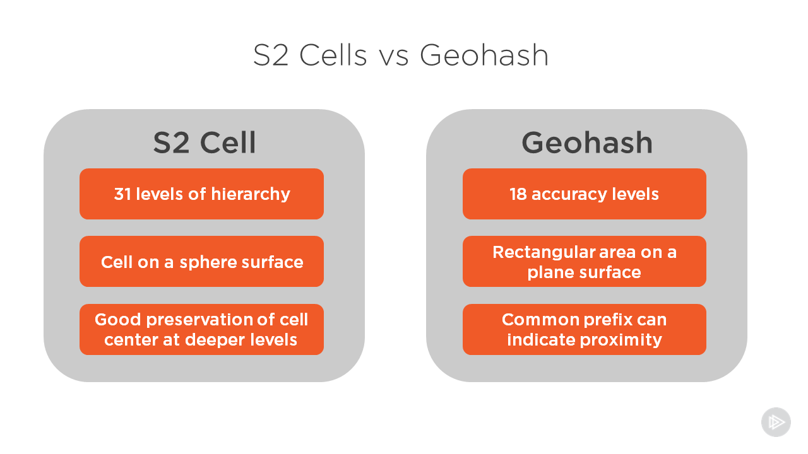

# Module 4 - Geoclustering

## Demo 3 - Clustering

### 3.1 Clustering Based on S2 Cells - Overview

In the first example, we'll see how to perform geoclustering based on S2 cells. Now, you may be wondering "What in the world is an S2 cell?"

That's a great question, let's head over to the [S2Geometry](https://s2geometry.io/devguide/s2cell_hierarchy) website to look at their definition.

In S2Geometry, the earth is divided into cells. Each cell is further subdivided into cells, and each of those into even more cells. S2 Cells can go up to 30 levels deep.

In looking at the map on their website, your reaction may be "But wait, those aren't square cells, their curved!" True, but remember with maps like this we are taking a sphere and flattening it out.

The curves are similar to what you see on a map when you are looking at an airplane flight bringing your mother in law for a visit. On the map it looks like the plane is taking a curved route, but over the planet the plane is flying in a straight line.

So how can we plot our data, in this case storm data, using the S2 Cell system? Well lucky for us, Kusto has a couple of functions just for that. Let's take a look!

#### 3.1.1 Examining the Code

As with our other demos, we'll start by defining a json variable with a set of geographic coordinates, filled with longitudes and latitudes. These coordinates define the state of California.

```python
let california = dynamic( { "type":"Polygon"
                        ,   "coordinates":[ [ [-123.233256,42.006186]
                                            , [-122.378853, 42.011663]
                                            , [-121.037003, 41.995232]
                                            , [-120.001861, 41.995232]
                                            , [-119.996384, 40.264519]
                                            , [-120.001861, 38.999346]
                                            , [-118.71478, 38.101128]
                                            , [-117.498899, 37.21934]
                                            , [-116.540435, 36.501861]
                                            , [-115.85034, 35.970598]
                                            , [-114.634459, 35.00118]
                                            , [-114.634459, 34.87521]
                                            , [-114.470151, 34.710902]
                                            , [-114.333228, 34.448009]
                                            , [-114.136058, 34.305608]
                                            , [-114.256551, 34.174162]
                                            , [-114.415382, 34.108438]
                                            , [-114.535874, 33.933176]
                                            , [-114.497536, 33.697668]
                                            , [-114.524921, 33.54979]
                                            , [-114.727567, 33.40739]
                                            , [-114.661844, 33.034958]
                                            , [-114.524921, 33.029481]
                                            , [-114.470151, 32.843265]
                                            , [-114.524921, 32.755634]
                                            , [-114.72209, 32.717295]
                                            , [-116.04751, 32.624187]
                                            , [-117.126467, 32.536556]
                                            , [-117.24696, 32.668003]
                                            , [-117.252437, 32.876127]
                                            , [-117.329114, 33.122589]
                                            , [-117.471515, 33.297851]
                                            , [-117.7837, 33.538836]
                                            , [-118.183517, 33.763391]
                                            , [-118.260194, 33.703145]
                                            , [-118.413548, 33.741483]
                                            , [-118.391641, 33.840068]
                                            , [-118.566903, 34.042715]
                                            , [-118.802411, 33.998899]
                                            , [-119.218659, 34.146777]
                                            , [-119.278905, 34.26727]
                                            , [-119.558229, 34.415147]
                                            , [-119.875891, 34.40967]
                                            , [-120.138784, 34.475393]
                                            , [-120.472878, 34.448009]
                                            , [-120.64814, 34.579455]
                                            , [-120.609801, 34.858779]
                                            , [-120.670048, 34.902595]
                                            , [-120.631709, 35.099764]
                                            , [-120.894602, 35.247642]
                                            , [-120.905556, 35.450289]
                                            , [-121.004141, 35.461243]
                                            , [-121.168449, 35.636505]
                                            , [-121.283465, 35.674843]
                                            , [-121.332757, 35.784382]
                                            , [-121.716143, 36.195153]
                                            , [-121.896882, 36.315645]
                                            , [-121.935221, 36.638785]
                                            , [-121.858544, 36.6114]
                                            , [-121.787344, 36.803093]
                                            , [-121.929744, 36.978355]
                                            , [-122.105006, 36.956447]
                                            , [-122.335038, 37.115279]
                                            , [-122.417192, 37.241248]
                                            , [-122.400761, 37.361741]
                                            , [-122.515777, 37.520572]
                                            , [-122.515777, 37.783465]
                                            , [-122.329561, 37.783465]
                                            , [-122.406238, 38.15042]
                                            , [-122.488392, 38.112082]
                                            , [-122.504823, 37.931343]
                                            , [-122.701993, 37.893004]
                                            , [-122.937501, 38.029928]
                                            , [-122.97584, 38.265436]
                                            , [-123.129194, 38.451652]
                                            , [-123.331841, 38.566668]
                                            , [-123.44138, 38.698114]
                                            , [-123.737134, 38.95553]
                                            , [-123.687842, 39.032208]
                                            , [-123.824765, 39.366301]
                                            , [-123.764519, 39.552517]
                                            , [-123.85215, 39.831841]
                                            , [-124.109566, 40.105688]
                                            , [-124.361506, 40.259042]
                                            , [-124.410798, 40.439781]
                                            , [-124.158859, 40.877937]
                                            , [-124.109566, 41.025814]
                                            , [-124.158859, 41.14083]
                                            , [-124.065751, 41.442061]
                                            , [-124.147905, 41.715908]
                                            , [-124.257444, 41.781632]
                                            , [-124.213628, 42.000709]
                                            , [-123.233256, 42.006186]
                                            ]
                                          ]
                          }
                        );
```

In the next line, we're going to create a new variable, `s2Level`.

```python
let s2Level = 7;
```

If you recall from the overview, I mentioned that each S2 cell could be subdivided into more S2 cells. These cells can go up to 30 levels deep. Here we're going to use this variable to indicate we want to go down to the 7th level of cells.

Next, we'll use the same `geo_point_in_polygon` function we saw in the last demo to limit our storm results to just those that occurred in the state of california.

```python
StormEvents
  | project BeginLon, BeginLat, EventType
  | where geo_point_in_polygon(BeginLon, BeginLat, california)
```

In the next line of our query, we're going to use `summarize` to get counts of our data.

```python
  | summarize eventCount = count() by EventType
            , hash = geo_point_to_s2cell(BeginLon, BeginLat, s2Level)
```

We will group first by the event type (Tornados, Heavy Rain, etc.), assigning the column name of `eventCount` to the count.

The second part of our summary will be the S2 cell. To get the S2 cell, we will employ the `geo_point_to_s2cell` function. In it we pass the column names for our longitude and latitude. The final value is the level we want to drill down to, here indicated by the value in `s2Level`.

The `geo_point_to_s2cell` function returns a hashed string with the S2 cell information, which we will assign to the new column appropriately named `hash`.

In the next line of code, we'll project our new columns we'll need to render the data in a map.

```python
  | project geo_s2cell_to_central_point(hash), EventType, eventCount
```

The first column employs the `geo_s2cell_to_central_point` function. This takes the hash value for the S2 cell, and converts it to the long/lat for the central point in the S2 cell. We then add the event type and count to the projected output.

With this data we can now render the data as a series of pie charts, overlaid on the map of California.

```python
  | render piechart with (kind=map)
```

#### 3.1.2 Analyzing the Output

Let's take a look at the resulting map. Or I should say maps, as the maps render differently depending on which tool you use to execute the query. Here is the map as rendered in the Azure Data Explorer webpage.



If the map has a single dot, then it represents a single storm event. If there are smaller dots within a bigger dot, they represent smaller portions of the counts, similar to the way a normal pie chart subdivides its data. You can click on any of the dots to get more information on what type of event it was, as well as the count of that event.

Now let's see what the output looks like using the Kusto one click desktop application.



In this rendering of the map, you see actual pie charts on the map. There is a helpful color map on the upper right which shows the various event types and their corresponding colors. If you were to click on any of them, a pop up would provide exact numbers for each event type for that location.

### 3.2 Clustering Based on Geohashing - Overview

As an alternative to using S2 cells for clustering, you can also use a concept known as a _geohash_.

#### 3.2.1 Examining the Code

The code begins by defining the polygon for California. As this is exactly the same as the previous demo we'll skip inclusion of it to keep this document brief.

Next, we define a variable called `accuracy`.

```python
let accuracy = 3;
```

We'll cover accuracy more in must a moment, meanwhile the next few lines are the same as the previous demo. We take our storm events table and pipe it through `project` to limit the amount of data we work with. We then use the `geo_point_in_polygon` function to further limit the data to just the state of California.

```python
StormEvents
  | project BeginLon, BeginLat, EventType
  | where geo_point_in_polygon(BeginLon, BeginLat, california)
```

In the next statement we use `summarize` to count our events, and subdivide those by the location. The location is determined using the `geo_point_to_geohash` function.

```python
  | summarize eventCount = count() by EventType
            , hash = geo_point_to_geohash(BeginLon, BeginLat, accuracy)
```

The function will use the long/lat stored in the BeginLon and BeginLat columns to calculate a string hash value for that location. The accuracy value is a number in the range of 1 to 18. The higher the value, the longer and hence more accurate the hash will be.

Conversely, having a larger number may result in many more clusters on the map, many of which are so low as not to be useful in analysis.

Note this value is an optional parameter, if omitted the default value of 5 will be used.

Next, we'll use `project` to output a new set of columns.

```python
  | project geo_geohash_to_central_point(hash), EventType, eventCount
```

The last two are pretty obvious. it is the event type and count of those events. With the `geo_geohash_to_central_point`, we take our hash value and convert it to a set of long/lat coordinates.

With that done, we can render a nice map overlaid with pie charts.

```python
  | render piechart with (kind=map)
```

#### 3.2.2 Analyzing the Output

The same differences with map rendering in the ADX website versus the Kusto desktop app also exist in this output, concentric blue dots on the ADX site and actual pie charts in the desktop app.

For brevity, we'll just show the output of the Kusto app here.



### S2 Cells vs Geohash

At this point you are likely wondering what is the difference between using the S2 Cell method versus Geohashing for geographic analysis. This image provides a good overview.



The first difference comes in the levels of accuracy. S2 cells can go all the way to 31 levels of accuracy, as contrasted to the 18 levels in a geohash.

Second is the method by which their cells are plotted on a map. As you saw in the beginning of the course, S2 uses a spherical map, so cells appear to have a slightly curved shape when plotted on a flat map. Contrast this with geohashing, which uses rectangular cells laid out on a plane, rather than a sphere.

S2 Cells do better job of preserving the center point of a cell, as compared to a geohash. However, looking at the value of an S2 cell provides no useful information when compared to another S2 value. Geohashes on the other hand, use a system where the first part of the code, or the prefix, can indicate proximity to another code.

In a simplified example, and note these aren't real geohash values, let's say you had three hashes of aaa1, aaa2, and abc1.  The two hashes with aaa in the beginning would be closer together geographically than the hash that begins with abc.

### Summary

Using the techniques in this section of the module, you can provide two different methods for clustering your data within a geographic fence. Here, we fenced off the state of California, and created clusters based on the event types and number of those events.
