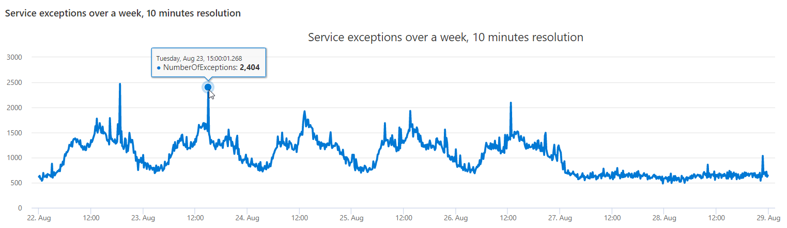
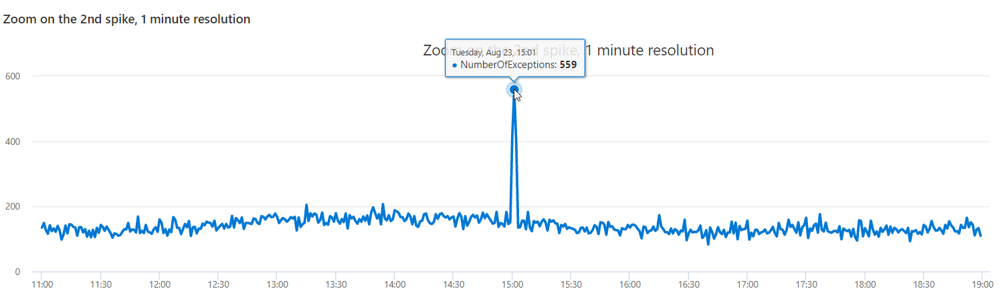

# Module 5 - Performing Diagnostic and Root Cause Analysis

## Demo 1 - Clustering a Single Recordset

### Overview

In this demo, we're going to see how to cluster a single record set of exceptions. We'll create a time series chart to quickly visualize spike anomalies and drill down to one of them to further investigate.

### A Quick Overview of Our Data

First, let's get a count of rows for our sample table to see the volume we're dealing with.

```python
demo_clustering1
  | count
```

As of the time of this writing, there are 1,023,652 rows in the demo_clustering1 table. (Please note this value may vary as Microsoft makes updates to the sample data.)

If we want to see a sample of the data, we can run the following query.

```python
demo_clustering1
  | take 5
```

This returns the following data.

| PreciseTimeStamp | Region | ScaleUnit | DeploymentId | Tracepoint | ServiceHost |
| ----- | ----- | ----- | ----- | ----- | ----- |
| 2016-08-25 13:37:30.1013530 | ncus | su1 | 8d0625ea0182482da41c422a4021813c | 520010 | 610137c1-1fe1-417b-827d-de6b43b8c689 |
| 2016-08-25 13:37:30.1559327 | ncus | su1 | 8d0625ea0182482da41c422a4021813c | 512005 | 00000000-0000-0000-0000-000000000000 |
| 2016-08-25 13:38:17.0655320 | ncus | su1 | 8d0625ea0182482da41c422a4021813c | 512005 | 00000000-0000-0000-0000-000000000000 |
| 2016-08-25 13:38:17.1807215 | ncus | su1 | 8d0625ea0182482da41c422a4021813c | 520010 | 610137c1-1fe1-417b-827d-de6b43b8c689 |
| 2016-08-25 13:38:17.5728823 | ncus | su1 | 8d0625ea0182482da41c422a4021813c | 512005 | 00000000-0000-0000-0000-000000000000 |

The precise meaning for each column is not important for this demo, simply understand each row represents a service exception in our (mythical) Azure environment. The column of importance to us is the `PreciseTimeStamp`, which holds the exact time the exception occurred.

### Charting Exceptions Over Time

In this section, we're going to render these exceptions as a timechart. Doing so allows us to visually look for spikes, in other words points in time where we had a high number (or peaks) of service exceptions.

The code for this is relatively straight forward.

```python
let min_t = toscalar(demo_clustering1 | summarize min(PreciseTimeStamp));  
let max_t = toscalar(demo_clustering1 | summarize max(PreciseTimeStamp));  
demo_clustering1
  | make-series NumberOfExceptions=count()
             on PreciseTimeStamp
           from min_t to max_t step 10m
  | render timechart
      with ( title="Service exceptions over a week, 10 minutes resolution" )
```

In the first two lines, we use summarize to calculate the min and max timestamps from our sample data, and save them into the `min_t` and `max_t` variables.

Next, we pipe our `demo_clustering1` table into the `make_series` function. If you want a more in-depth discussion on make-series I'll refer you to the next module, Time Series Analysis 1.

Here, we are creating a count aggregation and storing it in a new column `NumberOfExceptions`. Our aggregation is done over the `PreciseTimeStamp` column, its boundaries are from `min_t` to `max_t` times variables, and the `step 10m` clause defines the size of the aggregation blocks to 10 minutes. If we were to start on August 23rd at midnight, the first block, or bin, would count everything from 12:00 (included) to 12:10 (excluded). The next block would be from 12:10 to 12:20, and so on.

Finally we render the results as a timechart, providing a nice title for it. Here's the result.



In reviewing the data, we see two spikes towards the beginning of our chart. For our example, let's pretend we have already looked at the first one, and are now focused on the second spike.

If we hover the mouse over the top of the spike, we'll see the details of it, including the fact it occurred on 23 August at 15:00. This gives us a starting point to dig deeper, which we'll do in the next example.

### Digging Deeper into the Exceptions Spike

This query will be similar to the first.

```python
let min_t=datetime(2016-08-23 11:00);
demo_clustering1
  | make-series NumberOfExceptions=count()
             on PreciseTimeStamp
           from min_t to min_t+8h step 1m
  | render timechart
      with ( title="Zoom on the 2nd spike, 1 minute resolution" )
```

Here we want to check whether it’s a narrow or wide spike, so we “zoom in” by creating a new time series around the spike, from 4 hours before it to 4 hours after it, in 1 minute step size (10x the previous 10m resolution). We can now see that it’s indeed a sharp and narrow (2 minutes) spike



We now have the resolution to see the exact minute our spike ocurred, 15:01. Let's construct a query to return the exceptions that occured during this 2 minutes spike for further analysis.

### Looking at the Detail Data

Now that we know the spike occurred at 15:01, we'll construct a query to grab data for one minute to either side, 15:00 to 15:02.

```python
let min_peak_t=datetime(2016-08-23 15:00);
let max_peak_t=datetime(2016-08-23 15:02);
demo_clustering1
  | where PreciseTimeStamp between(min_peak_t..max_peak_t)
```

This query returned 972 rows x 6 columns (based on the sample data at the time of this writing). Let's see few rows here. Note that commonly you will have much bigger result sets, containing thousands or even millions of rows and plenty of columns.

| PreciseTimeStamp | Region | ScaleUnit | DeploymentId | Tracepoint | ServiceHost |
| ----- | ----- | ----- | ----- | ----- | ----- |
| 2016-08-23 15:00:00.5050216 | scus | su5 | 9dbd1b161d5b4779a73cf19a7836ebd6 | 10007006 | a7292804-72d3-4ad1-aac5-3c52c9176a00 |
| 2016-08-23 15:00:01.4303398 | scus | su3 | 90d3d2fc7ecc430c9621ece335651a01 | 12040111 | 00000000-0000-0000-0000-000000000000 |
| 2016-08-23 15:00:01.4318226 | scus | su3 | 90d3d2fc7ecc430c9621ece335651a01 | 12040111 | 00000000-0000-0000-0000-000000000000 |
| 2016-08-23 15:00:01.4955374 | weu | su4 | be1d6d7ac9574cbc9a22cb8ee20f16fc | 12040111 | 00000000-0000-0000-0000-000000000000 |
| 2016-08-23 15:00:01.5013331 | weu | su4 | be1d6d7ac9574cbc9a22cb8ee20f16fc | 12040111 | 00000000-0000-0000-0000-000000000000 |

As this is a small result set you can review it, try to look on common values, correlations or other reasons that might explain the spike in exceptions.

### Summary

In this demo, we saw a dataset of service exceptions over 1 week. Using basic time series analysis we were able to detect anomalous spikes. We drilled down to a specific spike and review the exception records during that spike, attempting to guess its root cause. In the following parts we are going to see clustering plugins that will help us to find the root cause automatically.
