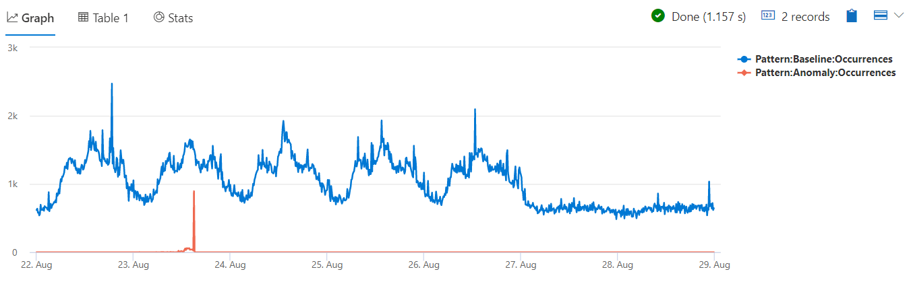

# Module 5 - Performing Diagnostic and Root Cause Analysis

## Demo 4 - Clustering the Difference

### Overview

The diffpatterns plugin can characterize differences between two records sets. Frequently it is used to compare records in different time windows, but the split to two records sets can be by another metric within the same time window.

For this demo we'll pick up where the first demo in this module left off. In it, we identified a spike in exceptions that occurred at 15:01 on Aug 23rd. What we want to do now is compare the exceptions' spike that occurred in the two minutes around that incident (15:00 to 15:02) to the exceptions level eight minutes prior to the spike, during which everything seemed to be running OK.

### Examining the Code

Let's look at the code needed to execute the diffpatterns plugin to perform this analysis of our spike.

We'll start by defining start and end variables for the anomaly time range.

```python
let anomaly_start  = datetime(2016-08-23 15:00);
let anomaly_end    = datetime(2016-08-23 15:02);
```

This date range represents the time during which our anomaly, the spike in exceptions, occurred.

Next we'll define our baseline time range.

```python
let baseline_start = datetime(2016-08-23 14:50);
let baseline_end   = datetime(2016-08-23 14:58);
```

This is the start and end times for our baseline, the eight minute window when everything was running fine. Note that we left the 2 minutes before the spike out of the baseline. This is a "gray zone", in most cases leaving it out of the analysis can generate better and cleaner patterns.

```python
let split_time=(baseline_end + anomaly_end) / 2.0;
```

Here, we've calculated what is called split time. This is time that marks the end of the baseline and the beginning of our anomalous time. We set it to the middle time point between the end of the baseline and the start of the anomaly, which is 14:59.

Now we can start building the data set.

```python
demo_clustering1
  | where (PreciseTimeStamp between(baseline_start..baseline_end))
       or (PreciseTimeStamp between(anomaly_start..anomaly_end))
```

These few lines are straight forward. We take our dataset, and reduce it to contain only exceptions that were within either the baseline or the anomaly time ranges.

Next, we need to create a column which can be used for the diffpatterns plugin to determine if a specific exception came from the baseline time frame, or the anomaly.

```python
  | extend AB=iff(PreciseTimeStamp > split_time, 'Anomaly', 'Baseline')
```

The new column will be named `AB` (short for Anomaly/Baseline). We are using the `iff` function, basically an if - then - else statement. If the time on the current row is greater than our `split_time`, we know it is in the anomaly time range, and then the text value **Anomaly** will be set in the `SplitValue` column. Otherwise, the value **Baseline** will be set.

We could have, in fact used any text value for these. A simple A and B, Error and Normal, or Bert and Ernie for example. It's usually best though to use a word that identifies the split, then use that naming standard across all your queries that employ diffpatterns.

Speaking of diffpatterns, we're finally ready to call it.

```python
  | evaluate diffpatterns(AB, 'Anomaly', 'Baseline')
```

We start with evaluate as this is a plugin, then call the diffpatterns. The first parameter is the name of the column from the incoming dataset that holds the value to be used for the split. Here we are using the `AB` column we just created.

The next parameters `'Anomaly'` and `'Baseline'` define the 2 subsets to compare. Note that in KQL the input to any operator/plugin is a single table (before the “|”). So the first step of diffpatterns is to take the single input table and split it to 2 subsets: “tbl | where AB == ‘Anomaly’ “ and “tbl | where AB == ‘Baseline’ “, then it can start mining for patterns and comparing them on both subsets.

In the output, you will see column names like CountA, CountB, PercentA, PercentB, and so forth. The data that comes into the A columns will come from the value in the second parameter. In this case, data with the `AB` value of **Anomaly** will be aggregated into CountA, PercentA, and so on. Where rows have a `AB` value of **Baseline**, the data will be aggregated into the B columns, CountB, PercentB, and so forth.

### Analyzing the Output

Running the query, diffpatterns returns few patterns, ordered top down by their significance:

| SegmentId | CountA | CountB | PercentA | PercentB | PercentDiffAB | PreciseTimeStamp | Region | ScaleUnit | DeploymentId | Tracepoint | ServiceHost |
| ----- | ----- | ----- | ----- | ----- | ----- | ----- | ----- | ----- | ----- | ----- | ----- |
| 0 | 639 | 21 | 65.74 | 1.7 | 64.04 |  | eau | su7 | b5d1d4df547d4a04ac15885617edba57 |  | e7f60c5d-4944-42b3-922a-92e98a8e7dec |
| 1 | 167 | 544 | 17.18 | 44.16 | 26.97 |  | scus |  |  |  |  |
| 2 | 92 | 356 | 9.47 | 28.9 | 19.43 |  |  |  |  | 10007007 |  |
| 3 | 90 | 336 | 9.26 | 27.27 | 18.01 |  |  |  |  | 10007006 |  |
| 4 | 82 | 318 | 8.44 | 25.81 | 17.38 |  | ncus | su1 | e24ef436e02b4823ac5d5b1465a9401e |  |  |
| 5 | 55 | 252 | 5.66 | 20.45 | 14.8 |  | weu | su4 | be1d6d7ac9574cbc9a22cb8ee20f16fc |  |  |
| 6 | 57 | 204 | 5.86 | 16.56 | 10.69 |  |  |  |  |  | 00000000-0000-0000-0000-000000000000 |

Let's look at our top pattern:

| Attribute | Value |
| ----- | ----- |
| Region | eau |
| Scale Unit | su7 |
| DeploymentId | b5d1d4df547d4a04ac15885617edba57 |
| Tracepoint | NULL |
| ServiceHost | e7f60c5d-4944-42b3-922a-92e98a8e7dec |

Within our anomaly time period, this pattern contains 639 exceptions, or 65.74% of exceptions during this window. Note that we already found this same pattern with autocluster and with basket. But with diffpatterns we also see how common this pattern was in the baseline period.

Contrasted with the anomalous window, in the baseline window this pattern contains only 21 exceptions, or 1.7% of all exceptions in the baseline. The difference (shown in the PercentDiffAB column) is a whopping 64.04%! Clearly this pattern is the cause of our issues.

Remember the first demo of this module, in which we generated a timechart where we plotted the number of exceptions over time. This allowed us to easily identify a spike in exceptions for a specific time. It was this spike that lead us to use autocluster, basket and now diffpatterns for further investigation.

As a final verification step, we can now use the identified pattern and split the data into two lines on our timechart – one for the exceptions count originated from this pattern and another timechart for all other exceptions:

```python
let min_t = toscalar(demo_clustering1 | summarize min(PreciseTimeStamp));  
let max_t = toscalar(demo_clustering1 | summarize max(PreciseTimeStamp));  
demo_clustering1
  | extend Pattern = iff( Region == "eau"
                             and ScaleUnit == "su7"
                             and DeploymentId == "b5d1d4df547d4a04ac15885617edba57"
                             and ServiceHost == "e7f60c5d-4944-42b3-922a-92e98a8e7dec"
                         , "Anomaly"
                         , "Baseline"
                         )
  | make-series Occurrences=count()
            on PreciseTimeStamp
          from min_t to max_t step 10m
            by Pattern
  | render timechart
```

We start by creating variables to hold the max and min time values for the entire dataset.

Next a new column is added to the `demo_clustering1` dataset, `Pattern`. This uses the same `iff` technique from earlier. If the row has the specific attributes then we return a text value of **Anomaly** to the Pattern column. Otherwise, we return the value **Baseline**. Note that the specific attributes we split by are those we got from diffpatterns.

`make-series` is then used to generate 2 time series, one containing the counts of the exceptions that were originated from the Pattern, and one containing counts of all other exceptions, in 10 minutes steps. Piping the output into our `render` yields the following chart:



With the anomaly pattern now isolated into its own line, we can see that it was indeed this pattern that caused the spike in our exceptions.

### Summary

Diffpatterns is an advanced machine learning plugin that can mine your data and generate multi-dimensional patterns that can help investigation and root cause analysis of anomalous behavior in your data. As it analyzes the differences between 2 sets of records, it’s more complex to use compared to autocluster or basket plugins, but is more powerful.

Also note that while in this example we generated differences for different points in time, we can use other dimensions besides time to split our data. For example, we can analyze http requests over one week and try to characterize the attributes of slow requests vs fast requests. In this example the duration of the request could be used to split the records set to 2 subsets. We might specify a duration of less than one second for our baseline subset, and durations that exceed 10 seconds for our anomaly subset.
