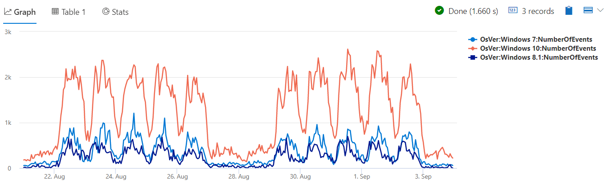

# Module 6 - Time Series Analysis 1 - Creation and Core Functions

## Demo 1 - Time Series Creation

### Overview

In this demo we'll see how to create a _time series_. A time series is a dataset designed to be analyzed over time.

The KQL `make_series` operator plays a key role in the creation of a time series. It works by taking an input dataset, and aggregating a value based on time, to create a new dataset.

### Examining the Code

The data we will be using for this demo comes from the `demo_make_series1` table, part of the public sample database from Azure Data Explorer. Let's get a quick look at the source data. We'll use the following query to bring back a few rows of data.

```python
demo_make_series1
  | take 5
```

Below is a sample of the data. Note that your results may be different, the `take` operator grabs a random set of rows which can be different upon each execution of the query.

| TimeStamp | BrowserVer | OsVer | Country |
| ----- | ----- | ----- | ----- |
| 2016-08-25 09:12:58.0110000 | Chrome 52.0 | Windows 10 | United Kingdom |
| 2016-08-25 09:12:58.1470000 | Internet Explorer 11.0 | Windows 10 | United Kingdom |
| 2016-08-25 09:12:58.7420000 | Firefox 48.0 | Windows 8.1 | Netherlands |
| 2016-08-25 09:12:59.2140000 | Edge 12.10240 | Windows 10 | Netherlands |
| 2016-08-25 09:13:01.7480000 | Chrome 52.0 | Windows 7 | India |

When someone accesses our system, we log the date / time they did so, along with the browser they were using, what operating system, and what country they came from.

Our goal for this analysis is to easily compare number of logins by the users operating systems. Let's look at the query needed to accomplish this.

We'll start by declaring two variables.

```python
let min_t = toscalar(demo_make_series1 | summarize min(TimeStamp));
let max_t = toscalar(demo_make_series1 | summarize max(TimeStamp));
```

These should be familiar to you by now. We are simply taking our dataset, `demo_make_series1` and getting the minimum and maximum date/time, then saving them into the variables.

Next, we'll use `make-series` to aggregate our counts and create a new dataset.

```python
demo_make_series1
  | make-series NumberOfEvents=count() default=0
             on TimeStamp
           from min_t to max_t step 1h
             by OsVer
```

In the call to `make-series`, we first indicate we want to aggregate based on count, counting the number of rows. We are naming the count `NumberOfEvents` so in the output dataset it will have a meaningful name. We also supply a value to use as the default value in case there are no rows in specific time bins. For analyzing time series it’s very important to keep all time bins, filling empty ones, otherwise we distort the time axis which can lead to faulty analysis.

Now we indicate what axis to aggregate on, in this case it is our `TimeStamp` column.

In the `from` line, we first set the range for our query, here going from the minimum time to the maximum time in our dataset.

The next part of the line, `step`, is important. Here we use a step of 1 hour. This means our counts will be aggregated into one hour buckets, also called bins.

We add one more component, the `by OsVer`. The `OsVer` will be the partition key. We will aggregate and create a separate time series for each OsVer. There's still one more line to add to our query.

```python
  | render timechart
```

This, as you've seen many times now, renders our output into a nice chart.

### Analyzing the Output

And here is that chart.



When rendered like this, it's extremely easy to see that logins from Windows 10 computers far exceed those of older versions of Windows. You can also see the seasonal patterns over the 2 weeks of data. We can easily see the weekly seasonality - weekdays activity that is much higher than the weekend (in the middle of the chart), and the daily seasonality – midday activity is much higher than the night one.

### Summary

The `make-series` operator is a foundational component to time series analysis. We will build upon it, adding additional time series functions in the next demo.
