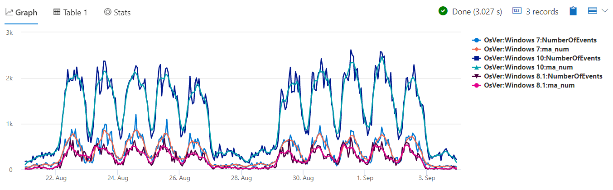
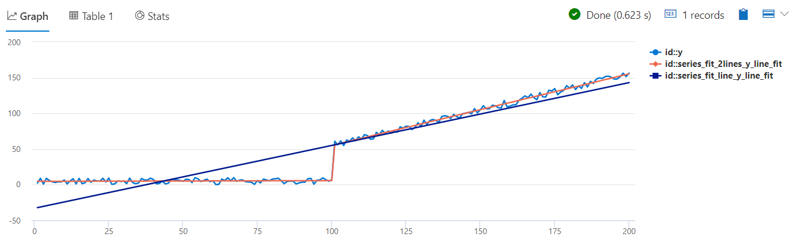
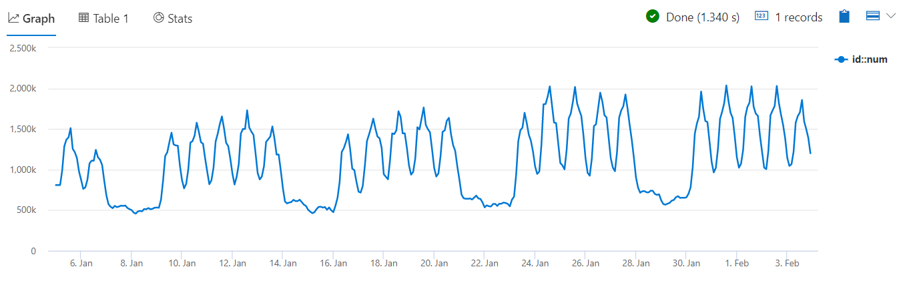
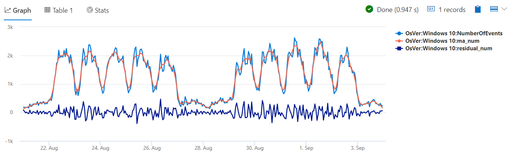

# Module 6 - Time Series Analysis 1 - Creation and Core Functions

## Demo 2 - Time Series Analysis Functions

### 1.1 Filtering Overview

This demo will comprise a number of functions which focus on time series analysis. The first of these is `series_fir`. FIR stands for Finite Impulse Response, and is used to calculate moving averages, change detection, and more. FIR is used in almost all signal processing systems including radio or video broadcasting, speech and sound processing and many other domains.

#### 1.1.1 Examining the Code

If this first example looks familiar, it should. It is the same query with we ended the previous demo, with one addition.

```python
let min_t = toscalar(demo_make_series1 | summarize min(TimeStamp));
let max_t = toscalar(demo_make_series1 | summarize max(TimeStamp));
demo_make_series1
  | make-series NumberOfEvents=count() default=0
             on TimeStamp
           from min_t to max_t step 1h
             by OsVer
  | extend ma_num=series_fir(NumberOfEvents, repeat(1, 5), true, true)
  | render timechart
```

On the next to the last line we've added an `extend` to add a new column. We're naming the new column `ma_num`, which stands for _moving average number_. It is the `series_fir` that will calculate it for us. Let's look at the various parameters.

The first one, `NumberOfEvents`, is the column containing value we want to average.

In the next position, we have the filter. Technically, this contains the coefficients of the filter, but you can think of it as defining the shape of the block for the moving average. If we wanted to create a moving average of five values, we could define the filter as [1,1,1,1,1]. We can also utilize the `repeat` operator, here we repeat the number 1 five times, which produces the same result.

The third parameter indicates whether we want to normalize our results. Normalization ensures the sum of the coefficients is 1, so we neither amplify nor attenuate the original signal. In our example it will transform the vector of coefficients from [1, 1, 1, 1, 1] to [0.2, 0.2, 0.2, 0.2, 0.2]. Note that if there are any negative coefficients we cannot normalize and this value must be set to false. It is an optional parameter, so if omitted it will default to true, unless there are negative values in the filter, in which case it will default to false.

The last parameter indicates whether we want to do a centered average or not, with false being the default. It will be easier to explain this using an example.

Let's say the first five values in NumberOfEvents is 10, 20, 30, 40, and 50. If we use a centered average, it will take the current value and center it in the middle of our [1,1,1,1,1] filter. Because there are no values before 10, since it's first, our average would be calculated as 0, 0, 10, 20, 30, resulting in a moving average of 12. On the next pass through the data, the next value of 20 takes the center spot, and our values become 0, 10, 20, 30, 40 resulting in a moving average of 20.

Let's contrast this with a backwards looking average. In it, values roll into the last position first, thus the first time the average is based on 0, 0, 0, 0, 10, resulting in 2. When the next sample is processed, we have 0, 0, 0, 10, 20, resulting in 6.

For streaming data we would like to set center to false, i.e. backward looking, as we don’t have future data and we can only average from the current sample backward. But note that averaging backward introduce some time delay, i.e. the moving average lags behind the original signal.

On the other hand, when we process historical data, then we prefer to set center to true. With historical data, every sample already has its “future” data, so we can perform symmetrical averaging around the specific sample, avoiding the time delay.

In our query, we've indicated we want to use normalization, as well as a centered moving average.

#### 1.1.2 Analyzing the Output

Our query ended with the command to render it as a timechart, so here is that chart.



In this chart we can see for each of the time series the respective moving average which is much smoother, as the moving average filtered the small fluctuations. Note that because we set center to true, the peaks and troughs of the moving average and the original metric lines are aligned.Had we set center to false they will be lagged behind the original ones.

### 1.2 Regression Analysis Overview

We can use regression analysis to calculate the line that best fits a series. In this demo, we'll look at two functions that can do this for us, `series_fit_line` and `series_fit_2lines`.

The `series_fit_line` function performs a linear regression to calculate the best line's parameters as well as its values. The `series_fit_2lines` is similar but more advanced - it finds the optimal split point and fit 2 independent line segments, where the first one fits the series data from the start to the split point, and the second one fits the data from after the split point to the end.

#### 1.2.1 Examining the Code

The code for this looks relatively simple.

```python
demo_series2
  | extend series_fit_2lines(y), series_fit_line(y)
  | render linechart with ( xcolumn=x )
```

The `demo_series2` table contains two columns, `x` and `y`. It then adds two new columns of data to our dataset, using the already mentioned `series_fit_line` and `series_fit_2lines` functions. Note that in this example the X-axis doesn't contain time points but numbers, so (x, y) represent generic series, not necessarily time series.

Finally, we render our output. As it's a generic series, we render a linechart instead of a timechart, and use the `with` clause to specify the `x` column in our source dataset as the X-axis in the chart.

#### 1.2.2 Analyzing the Output

The results of our query produce an interesting chart.



We can see that a single line is not optimal, as our series has step jump in the middle. on the other hand, two lines fit finds the split point correctly, and the fit of the 2 segments is almost perfect, putting aside the noise on the original series. We can now press the table button to review the fit parameters in tabular format. Just for easy reviewing, in the next query we will project only the relevant fit parameters.

#### 1.2.3 Examining the Code

Rather than charting the data, we can use this query to retrieve only the slope and r-square values of the two regression functions:

```python
demo_series2
  | extend series_fit_2lines(y), series_fit_line(y)
  | project series_fit_line_y_slope
          , series_fit_line_y_rsquare
          , series_fit_2lines_y_left_slope
          , series_fit_2lines_y_right_slope
          , series_fit_2lines_y_rsquare
```

#### 1.2.4 Analyzing the Output

Here are the results of our query:

| series_fit_line_y_slope | series_fit_line_y_rsquare | series_fit_2lines_y_left_slope | series_fit_2lines_y_right_slope | series_fit_2lines_y_rsquare |
| ----- | ----- | ----- | ----- | ----- |
| 0.879936864393257 | 0.874944924804405 | 0.0100560431915836 | 1.00181379415772 | 0.997072277363839 |

First, let's look on the slope - for a single line it's 0.88, positive trend, where each step the values increase. For 2 lines we see that the left part is 0.01, almost constant, while the right part, after the split point has a clear positive trend of 0.997. These parameters match what we visually saw in the graphs.

R-square is a number between 0 and 1, representing the quality of the fit. If the r-square of 2 lines fit (`series_fit_2lines_y_rsquare`) is much better (higher) than r-square of a single line fit (`series_fit_line_y_rsquare`) it means that there is a true change point in the time series, that justifies breaking it to two distinct segments

In this example, the R-square for fitting a single line is 0.8749, while the R-square for fitting 2 lines is 0.9970, which is almost perfect fit (without the noise R-square would be 1), just as we saw previously on the chart.  Based on this output we indeed have a change point, justifying  breaking our sample into two distinct segments.

### 1.3 Seasonality Detection Overview

Seasonality detection allows us to detect repeating patterns in our series, if exist. For example, in users' login activity we expect to have daily patterns, with peak activity in midday and minimal activity at night, as people are sleeping.

#### 1.3.1 Examining the Code

For this demo, we'll be using `demo_series3` table containing two columns: `t` which is a times vector and `num` which is an activity vector. Note that this is a "pre-cooked" table that was the output of running make-series operation on the original table, using 2 hours step. Before we look at our main query, let's visualize the data, using the query `demo_series3 | render timechart`.



Here you can see the data displays 2 seasonal patterns - one is the weekly pattern, where activity is high during the weekdays and low during weekends, and the other is the daily pattern, where activity is high during midday and low during night. Now we'd like to automatically detect these patterns. Here's the query to find it:

```python
demo_series3
  | project (periods, scores) = series_periods_detect(num, 0., 8d/2h, 2)  
```

We start of course with our dataset, piping it into the function `series_periods_detect`. In the first parameter we pass in the column name we want to analyze, in this case `num`. In the next two columns we pass in the minimum and maximum periods to search for. This is just a hint for the algorithm, to limit the periods search range. In this case, based on out domain knowledge, we do not expect to have periods longer than a week, so we limit our search to 8 days, taking some spare beyond 1 week.

Note that each of the time series values in `num` represent count in 2 hours bins, so we divide 8 days by 2 hours to get the search range in pure bins units. In our case, we look for periods whose length is up to 8d/2h=96 bins. Finally we tell the function the maximum number of periods to return, in this case we want 2.

The `series_periods_detect` returns two columns, `periods` and `scores`, so we'll use project to make these the main output of our dataset.

The two columns are actually arrays, so we'll need to use `mv-expand` to convert them into individual rows.

```python
  | mv-expand periods, scores
```

With that done, we can now add a new column to indicate the number of days for our periods.

```python
  | extend days=2h*todouble(periods)/1d
```

Remember, each period is 2 hours. So first, we will multiply the periods by two hours to get a total value in hours. We then take that result and divide by 1d to convert the hours into days. That calculation is then placed in the new column, `days`.

#### 1.3.2 Analyzing the Output

Here is the results of our query.

| periods | scores | days |
| ----- | ----- | ----- |
| 84 | 0.820622786055595 | 7 |
| 12 | 0.764601405803502 | 1 |

We see the number of periods, as well as the number of days represented by the periods. In our case, as we saw in the timechart, the function identified correctly both the weekly and the daily patterns. The score (a number between 0 and 1) indicates the confidence of that period. In our example the weekly score (0.82) is bigger than the daily score (0.76). This is due to the fact that the weekly pattern repeats consistently over the 4 weeks of our data, while the daily pattern repeats for the 5 weekdays but than changed for the 2 weekend days.

### 1.4 Element-wise Functions Overview

Our last demo in this section will build upon the first demo. In it, we used the `series_fir` function to calculate a moving average. We then plotted the moving average as well as the original value on a chart.

It would be nice to have the ability to highlight the difference in those two series. It sure would be nice if there was a function that would iterate over each element in the series and calculate it for us. Oh wait, there is! `series_subtract` is the solution here.

#### 1.4.1 Examining the Code

Our demo builds on the first one, with the addition of 2 lines of code:

```python
let min_t = toscalar(demo_make_series1 | summarize min(TimeStamp));
let max_t = toscalar(demo_make_series1 | summarize max(TimeStamp));
demo_make_series1
  | make-series NumberOfEvents=count() default=0
             on TimeStamp
           from min_t to max_t step 1h
             by OsVer
  | extend ma_num=series_fir(NumberOfEvents, repeat(1, 5), true, true)
   //to calculate residual time series
  | extend residual_num=series_subtract(NumberOfEvents, ma_num)
  | where OsVer == "Windows 10"
  | render timechart
```

Here we added a new line, in which we call the `series_subtract` function. We pass in the two series we want to subtract. In this case the second value, here `ma_num`, is subtracted from `NumberOfEvents`, the original series.

We added one other line, a where clause to limit us to just Windows 10. This simply made the new timechart easier to read for demo purposes.

#### 1.4.2 Analyzing the Output

Our timechart now shows the addition of a third line.



The bottom line represents the difference in the two values. Having it plotted as a separate line makes it easy to see and identify the variations that were filtered by  the moving average.

Note there are other similar functions, such as `series_add`, `series_multiply`, `series_divide`, `series_greater`, `series_less`, and many more.
