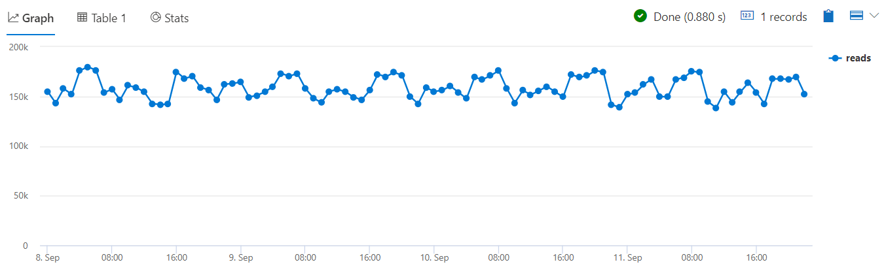
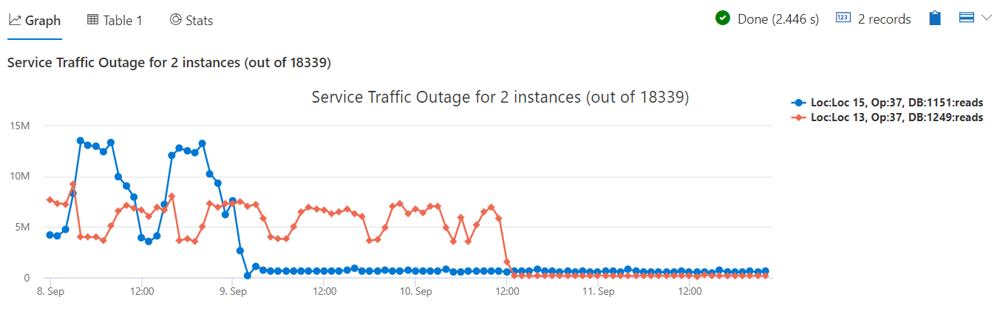

# Module 6 - Time Series Analysis 1 - Creation and Core Functions

## Demo 3 - Time Series Workflow at Scale

### Overview

In this final set of demos, we want to do two things. First, we want to show how well Azure Data Explorer process large numbers of time series. Second, we want to create a query that builds on the things you've already learned in this model to look for top anomalous time series out of thousands of time series based on the results of a linear regression analysis.

### Examining the Code

To start, lets run a few queries to get an idea of the scale of the data we're working with. In this demo, we'll use the `demo_many_series1` as our data source. Running a simple `demo_many_series1 | count` lets us know there are (at the time of this recording) 2,177,473 rows.

We can get an idea of the data contents by grabbing the first few rows with `demo_many_series1 | take 4`.

| TIMESTAMP | Loc | Op | DB | DataRead |
| ----- | ----- | ----- | ----- | ----- |
| 2016-09-11 16:00:00.0000000 | Loc 11 | 75 | 528 | 277534 |
| 2016-09-11 16:00:00.0000000 | Loc 11 | 37 | 542 | 193086 |
| 2016-09-11 16:00:00.0000000 | Loc 11 | 78 | 542 | 791 |
| 2016-09-11 16:00:00.0000000 | Loc 11 | 81 | 542 | 791 |

In addition to our timestamp, we have the location, Ops, DBs, and amount of data read. This table represents read counts of a distributed service over 4 days way back in 2016.The combination of Loc, Op and DB represent a unique instance of the service.

Now we'd like to identify anomalous behaviors in the data. At first, you might be tempted to run this query:

```python
let min_t = toscalar(demo_many_series1 | summarize min(TIMESTAMP));  
let max_t = toscalar(demo_many_series1 | summarize max(TIMESTAMP));  
demo_many_series1
  | make-series reads=avg(DataRead)
             on TIMESTAMP
           from min_t to max_t step 1h
  | render timechart with (ymin=0)
```

And this will yield output.



This read count timechart present the avg read count over 4 days over all instances of the service. It looks stable and healthy, there are some minor fluctuations in the read count but that's normal. But is it indeed normal for each instance of the service? Let's check...

Let's take just a moment to get an idea of the scale of the data we are working with. As we'll be generating a time series for each combination of Loc, Op, and Db, this query will let us know how many instances we are working with.

```python
demo_many_series1
  | summarize by Loc, Op, DB
  | count
```

This shows, at the time of this recording, we have 18,339 combinations of Loc, Op, and Db.

Now that we know the scale we are working with, let's proceed to a query that will analyze all 18,339 instances and let us know the ones we should be looking at.

In the following query we create a time series for every instance of the service, that is characterized by the Loc,Op and DB triplets. There are more than 18,000 time series. This is done by adding the `by Loc, Op, DB` to the end of the `make-series` command. Then we run linear regression on all time series at once, and select the top 2 that had the most negative trend. Finally we render them.

```python
let min_t = toscalar(demo_many_series1 | summarize min(TIMESTAMP));  
let max_t = toscalar(demo_many_series1 | summarize max(TIMESTAMP));  
demo_many_series1
    // Create a new series from our data aggregated by the Loc, Op, and DB
  | make-series reads=avg(DataRead)
             on TIMESTAMP
           from min_t to max_t step 1h
             by Loc, Op, DB
  | extend (rsquare, slope) = series_fit_line(reads)
  | top 2 by slope asc
  | render timechart
      with (title='Service Traffic Outage for 2 instances (out of 18339)')
```



We can see indeed that unlike the single chart (which aggregated all 18000 service instances) that looked normal, using bulk linear regression we extracted 2 specific instances of the service that stopped working, as their read count was normal but dropped to almost zero

### Summary

In the final demo of this module, we built on what we've learned. We have analyzed thousands of time series in few seconds and extracted few "needles", problematic instances of the service, out of the "big haystack" of all instances. This usage pattern is very powerful for real time health monitoring of cloud services, IoT devices and more.
