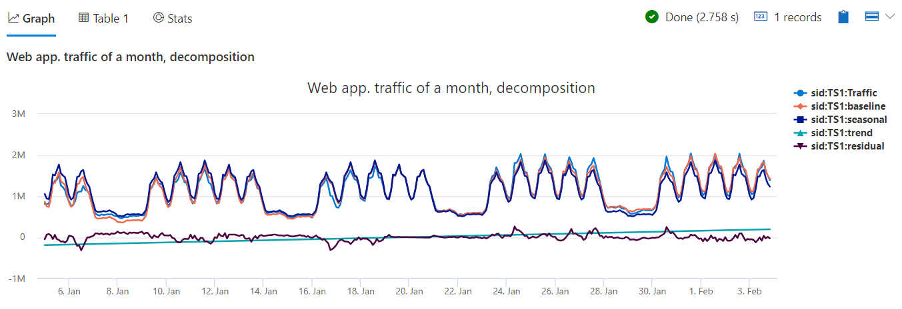

# Module 7 - Time Series Analysis 2 - Anomaly Detection and Forecasting

## Demo 1 - Seasonal Decomposition

### Overview

Decomposition allows us to take a time series and break it down into multiple components. These components include seasonal, trend, residual, as well as the baseline.

The baseline is the predicted value, to be used for forecasting. The residual is the input value minus the baseline, to be used for anomaly detection.

### Examining the Code

The source dataset for this demo is `demo_make_series2`, which has three columns. The first is `sid`, and is simply a server ID. Next is `TimeStamp`, the date/time the activity was logged. Finally is `num`, the sum of traffic on our server.

Let's break down our query into smaller components.

```python
let min_t = datetime(2017-01-05);
let max_t = datetime(2017-02-03 22:00);
let dt = 2h;
```

We start as we often do, with some variable declarations. The first two mark the start and end date ranges for this query. The last we'll use for the bin value, breaking our data into two hour buckets.

Next we employ our trusty pal `make-series` to summarize the data.

```python
demo_make_series2
  | make-series Traffic=avg(num)
             on TimeStamp
           from min_t to max_t step dt
             by sid
```

We'll aggregate our traffic using average, and rename it to something that is more descriptive. Next we add the TimeStamp to indicate the axis to aggregate on. The `from` line is used to define the aggregation boundaries and the step size in two hour buckets. Finally we'll add the `by` clause to create individual time series per server.

To make our output easier to read, we'll now add a filter for a single time series:

```python
  | where sid == 'TS1'
```

Next we call `series_decompose`

```python
  | extend (baseline, seasonal, trend, residual) = series_decompose(Traffic, -1, 'linefit')  
```

First, as indicated in our opener, the `series_decompose` returns four columns, all of them are time series components, so we'll need to use extend to add these columns to the time series created by `make-series`. In this example we explicitly specify (baseline, seasonal, trend, residual), a 4 element tuple to name the returned components, but we could omit it, using

```python
  | extend series_decompose(Traffic, -1, 'linefit')  
```

 and the function will return default names for the new columns.

The first parameter we pass into `series_decompose` is the name of the column to be analyzed, in this case `Traffic`.

The next parameter defines how to calculate the seasonal component. A value of `-1` tells our function to autodetect seasonality, behind the scenes it uses the function `series_periods_detect()`, which we already learned about. We can also provide a specific value, for example 84 (the number of 2 hours bins in a week), in that case we force using weekly seasonality, or `0`, which tells `series_decompose` to assume there is no seasonality.

The third parameter indicates how we want to calculate the trend component. Here, we are passing in the value of `'linefit'`, indicating we want linear regression, by using the function `series_fit_line()` that we already learned too. Note that the default is `'avg'`, which as it implies, will use average value of all bins for the trend component. Usually linear regression is needed for long periods, few weeks and beyond, while it might be redundant for short periods. We can also pass `'none'`, in which case `series_decompose` assumes there is no trend.

Finally, we'll tell the query to render the results into a timechart.

```python
  | render timechart
      with (title='Web app. traffic of a month, decomposition')
```

### Analyzing the Output



To better view you can hover or click on specific lines in the legend to highlight or view/hide them. Start by looking at `Traffic`, the original time series, then inspect `seasonal`, capturing the weekly pattern, `trend`, showing the gradual increase in traffic week over week and the `residual` which is the rest of the signal that we haven't modeled. Finally inspect `baseline`, the predicted traffic, which is just the sum of the seasonal and the trend components. In the next demos we will look for anomalies on the residual component, and forecast future traffic based on the baseline component.

### Summary

Using seasonal decomposition, you can break your time series into multiple components, each represent specific characteristic of the series. You can then use these components for further analysis, including anomaly detection and forecasting.
