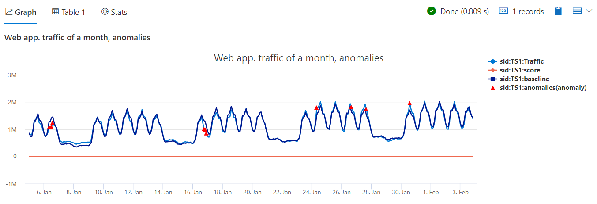

# Module 7 - Time Series Analysis 2 - Anomaly Detection and Forecasting

## Demo 2 - Anomaly Detection

### Overview

Anomaly detection allows us to identify outliers in our data. We can perform anomaly detection using the function `series_decompose_anomalies`. As its name implies, it builds on the `series_decompose` function we looked at in the previous demo. As many of the parameters function identically, we'll refer you back to the previous demo for in-depth details on these.

### Examining the Code

The first part of the query is identical to the previous demo for `series_decompose`.

```python
let min_t = datetime(2017-01-05);
let max_t = datetime(2017-02-03 22:00);
let dt = 2h;
demo_make_series2
  | make-series Traffic=avg(num)
             on TimeStamp
           from min_t to max_t step dt
             by sid
    // select a single time series for a cleaner visualization
  | where sid == 'TS1'  
```

We declare a time range, two hour step value, pipe the data into `make-series`, and step over the data in two hour increments by our server ID. Finally we filter down to just a single server.

Now we can call the `series_decompose_anomalies` function.

```python
  | extend (anomalies, score, baseline) = series_decompose_anomalies(Traffic, 1.5, -1, 'linefit')
```

The first parameter is the column name with the value to analyze. The second parameter indicates the threshold for detecting anomalies.This should be a positive value, the smaller the value, the higher detection sensitivity. The default is 1.5 which detect mild anomalies, set it to 3.0 to detect strong anomalies.

The next two are seasonality and trend, which work identically to `series_decompose`. The default `-1` will auto detect seasonality, and `'linelift'` will use linear regression for the trend.

The function returns three columns, anomalies, score, and baseline, each being a time series. Let's review them from the last to the first one.

The 'baseline' is exactly the same component that we got from `series_decompose`, the predicted value of the Traffic.

The 'score' is a value representing how much each point deviates from the baseline. 0 means this points is identical to the prediction, positive value means it's above the prediction, the higher the value the bigger the deviation from the predicted value. Negative value means, similarly, it's below the prediction.

The last and most important columns is 'anomaly'. This is a ternary column, indicating for each point +1 if it's an high anomaly, -1 if it's a low anomaly and 0 if it's not an anomaly. This column is calculated just by comparing the 'score' to the anomaly threshold (the 2nd input parameter). If the _absolute_ value of the score is below the anomaly threshold, then we set it to 0, as there is no anomaly. Otherwise, if the score is positive we set it to +1, as it's an high anomaly, and if the score is negative we set it to -1, as it's a low anomaly.

We'll then pipe this into a new type of chart, an anomaly chart.

```python
  | render anomalychart
      with (anomalycolumns=anomalies, title='Web app. traffic of a month, anomalies')
```

This is similar to a regular timechart, but specifying the anomaly column, it renders the anomalies as triangular bullets on top of the analyzed metric.

### Analyzing the Output



In this chart, the anomalies appear as red triangles on the Traffic line. You can see that indeed the anomalous points deviate from the baseline. You can hover on one to get more details.

### Summary

In this demo we presented how can we use the seasonal decomposition model for time series anomaly detection. Using this model is very powerful for detecting issues on top of expected metric that can have trend and seasonal patterns.
