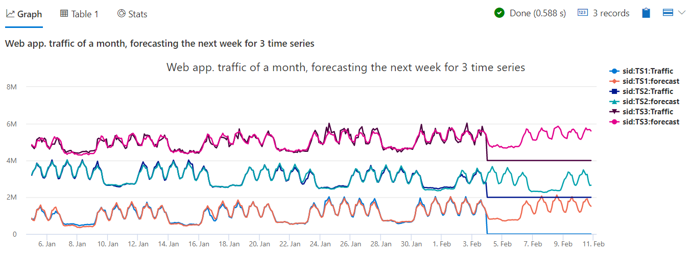

# Module 7 - Time Series Analysis 2 - Anomaly Detection and Forecasting

## Demo 4 - Scalability

### Overview

In this final demo, we're going to combine what we've done in the previous demos of this module to produce a forecast for multiple time series.

### Examining the Code

The first part of this query is identical to the previous demo.

```python
let min_t = datetime(2017-01-05);
let max_t = datetime(2017-02-03 22:00);
let dt = 2h;
let horizon=7d;
demo_make_series2
  | make-series Traffic=avg(num)
             on TimeStamp
           from min_t to max_t+horizon step dt
           by sid
```

This time we do not filter as before for a single time series, `TS1`, but our pipeline shall process all time series, three in our demo, at once.

In the timechart, we are going to have six lines - 3 pairs, each containing the original time series and its prediction. This lines would be drawn one on top of the other, making it difficult to view. So for this demo we will separate them by adding artificial offset to each of the time series pairs.

```python
  | extend offset=case(sid=='TS3', 4000000, sid=='TS2', 2000000, 0)
```

Here we are using the `case` statement. You can think of it as a series of if/then statements. Here, if the server id is TS3, it will place the value of 4,000,000 into our new `offset` column. If the server is TS2, 2,000,000 is put in `offset`. Finally, when case does not find another test condition but it does find a value, it interprets it as an `else` and will use the value of 0.

In an earlier demo we looked at the function `series_subtract`. Here we can use its peer, `series_add`, to add the value in the new offset column to the Traffic value.

```python
  | extend Traffic=series_add(Traffic, offset)
```

We wrap up by creating the forecast, then sending it to a timechart.

```python
  | extend forecast = series_decompose_forecast(Traffic, toint(horizon/dt))
  | render timechart
      with (title='Web app. traffic of a month, forecasting the next week for 3 time series')  
```

As we've seen these commands already we won't elaborate further, but go ahead and run the query.

### Analyzing the Output



Here we can see both the traffic and forecast for all three servers. This information can help us in load balancing our servers in the future.

### Summary

 The goal of this demo was to present how to forecast multiple time series at once. You only need to create multiple time series using the `by` clause in `make-series`, then the syntax of the following processing pipleline is identical, regardless if it's a single time series or many. 
 
 Processing multiple time series is optimized and very fast, as it's implemented using vecotrization methods. Here the forecast was done for only three time series, but as you have seen in the last demo of the previous module, it can be done on thousands of time series in seconds. As said there, this usage pattern is very powerful for real time health monitoring as well as for resource planning of cloud services, IoT devices and other scenarios.