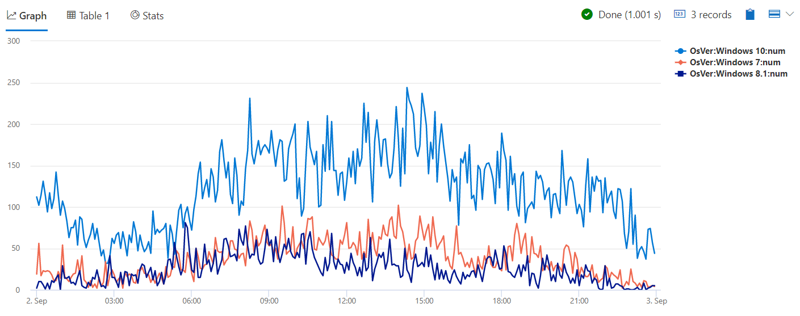
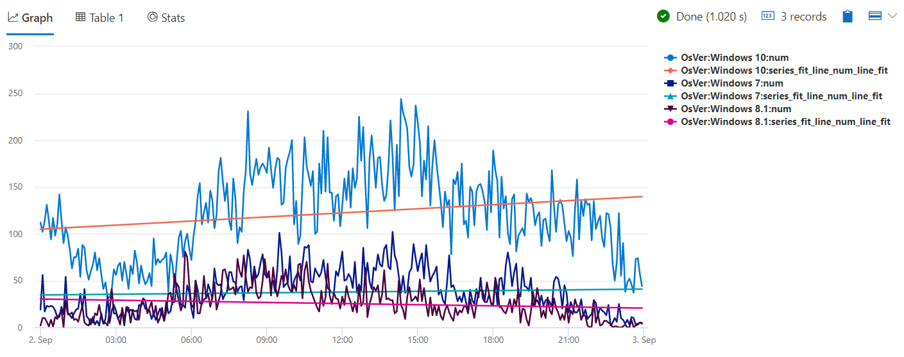
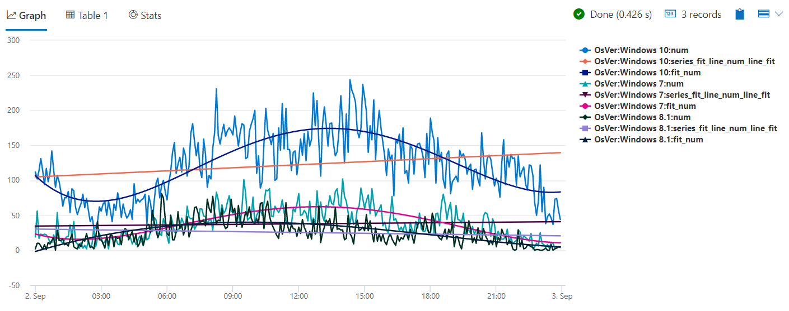

# Module 8 - Extensibility Using inline Python and R

## Demo 2 - Time Series Analysis with Python

### Overview

In this demo, we'll use the numpy package that is the major mathematical package of Python, in order to calculate best fit curves.

### The Source Dataset

```python
let max_t = datetime(2016-09-03);
demo_make_series1
  | make-series num=count()
             on TimeStamp
           from max_t-1d to max_t step 5m
             by OsVer
  | render timechart
```

This simple query is just a reminder of the dataset. We've seen queries very similar to this several times in recent modules. The chief difference is the time window, here we are selecting a single day and a bin of five minutes.



As you can see, this is simply the number of entries logged by each operating system over time, grouped in five minute bins.

### Attempting to use Series Fit Line

As a logical first step to finding the best fit line for our data set, we'll use the built in Kusto function `series_fit_line` to perform our linear regression.

```python
let max_t = datetime(2016-09-03);
demo_make_series1
  | make-series num=count()
             on TimeStamp
           from max_t-1d to max_t step 5m
             by OsVer
  | extend series_fit_line(num)
  | render timechart
```

As there are no new concepts here in terms of the KQL code, let's go ahead and run it to see the output.



Oh my! This isn't a good fit at all. Looking at any of the operating systems, we can see that the actual activity time series diverges wildly from the respective fitted lines.

So now what? Well, as you've probably guessed, we can use some Python to calculate a non-linear, high order polynomial curves, that fit the activity time series much better.

### Using Python

We'll start the query by declaring a variable to hold our Python code.

```python
let pyCode = 'in_series = kargs["in_series"]\n'
             'out_series = kargs["out_series"]\n'
             'degree = kargs["degree"]\n'
             '\n'
             'def fit(s, deg):\n'
             '# our fit function accept a single series\n'
             '# and the degree of the polynomial to fit\n'
                  //  create x axis with equally spaced sequential values
             '    x = np.arange(len(s))\n'
                  //  the best fit algebra is done here, returning the polynomial coefficients
             '    coeff = np.polyfit(x, s, deg)\n'
                  //  create a polynomial
             '    p = np.poly1d(coeff)\n'
                  //  extrapolate its values (y-axis) for the x values
             '    z = p(x)\n'
             '    return z\n'
             '\n'
             'result = df\n'
             //  use apply to call the fit function for each time series
             'result[out_series] = df[in_series].apply(fit, args=(degree,))\n';
```

As stated in the beginning of this module, we won't dissect the Python code here. We just added few inline comments, assuming that you have already experienced functions from the numpy package. The target of this demo is to explain how to embed this Python code inside KQL query.

I do want to call your attention to the comments. You can either use Kusto comments (marked by `//`) outside the strings that define the Python code, or Python comments (marked by '#') within the strings.

With the Python code variable created, we can now begin creating our query.

```python
let max_t = datetime(2016-09-03);
demo_make_series1
  | make-series num=count()
             on TimeStamp
           from max_t-1d to max_t step 5m
             by OsVer
  | extend series_fit_line(num)
```

We continue from where we left off. Note we keep the `series_fit_line`, so we can compare it to the high order polynomial curves that will be generated in our Python code.

```python
  | extend fit_num=dynamic(null)
```

When we call the python plugin, we will need a place to store the output time series. So here we define `fit_num` of `dynamic` type, to store the output time series arrays. Even though we set it in the Python code, we still need to initialize it, so we fill it with `null`s.

Now we're finally ready to call Python.

```python
  | evaluate python( typeof(*)
                   , pyCode
                   , pack('in_series', 'num', 'out_series', 'fit_num', 'degree', 4)
                   )  //  passing dictionary of script parameters to the Python sandbox
```

The first parameter, as you recall from the previous demo, specifies the output schema. Setting it to `typeof(*)` means that the output schema is the same as the input, i.e. all input columns are kept and there are no new columns (as we created the `fit_num` column before the call to python()).

The second parameter is the reference for the Python code. The last parameter is the key/value parameters dictionary. Here we pass `'num'`, the name of the column containing the input time series, `'fit_num'`, similar column name for the output time series and `4` as the degree for the polynomial fit (i.e. to fit by polynomials of the 4th order). Note that we pass the column names as strings, and the degree as int.

Finally we take all of this and render it as a timechart.

```python
  | render timechart
```

Let's run this to see the output.



As you can see, the dark blue curve of `Windows 10:fit_num` follows the path of the `Windows 10:num` value very closely, and is thus a far better fit than the built in `series_fit_line` that use linear regression (i.e. polynomial of 1st degree). Same for the other operating systems.

### Summary

As flexible and powerful as the Kusto Query Language is, there are times when you have to step outside of it to analyze your data. Using the python() plugin you can leverage the rich and free Python eco-system from within your KQL query.

Be aware when using inline Python (or R), performance and scalability are inferior compared to using native KQL. The best practice is to first try and solve your case using native KQL operators and functions, saving Python (or R) for cases you cannot solve using ADX native capabilities.
