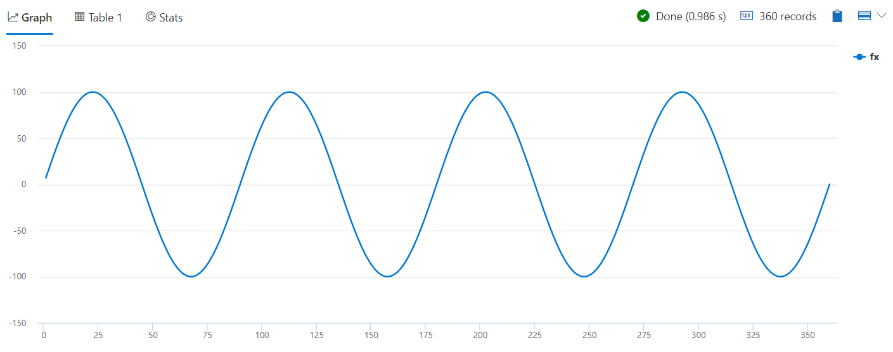

# Module 8 - Extensibility Using inline Python and R

## Demo 4 - Calling the R Plugin

### Overview

As mentioned in the opening of this module, in addition to calling Python, ADX also has a plugin for the R language. Here we'll take a quick look at calling some R code.

### Examining the Code

```python
let rCode = 'result <- df\n'
            'n <- nrow(df)\n'
            'g <- kargs$gain\n'
            'f <- kargs$cycles\n'
            'result$fx <- g * sin(df$x / n * 2 * pi * f)';
range x from 1 to 360 step 1
    // Output schema: append a new fx column to original table
  | evaluate r( typeof(*, fx:double)
              , rCode
                //  dictionary of parameters
              , pack('gain', 100, 'cycles', 4)
              )
  | render linechart
```

This code just calculates a simple sine wave using R and draws it.

As you can see the structure and mechanics are the same as for Python.The only difference is that instead of python() you call the r() plugin:

`| evaluate r(...)`

### Analyzing the Output

Here is the linechart of our sine wave:



### Summary

In this final demonstration, we learned how to call R from within KQL query. If it was not clear by now, you can build a single powerful KQL query, mixing native functions, Python and R, enabling you to enjoy the candies of all these great data science environments.

A final reminder, in order to perform the demonstrations in this one module, you will need to be running on your own private cluster with the Python and R extensions enabled.

If you setup a dev cluster for the purpose of testing out the code in this module, you should also remember to delete it when you no longer need it. While 21 cents (in US currency) per hour for a dev cluster is not a lot of money, it will begin to add up if you forget about it and leave it running.
